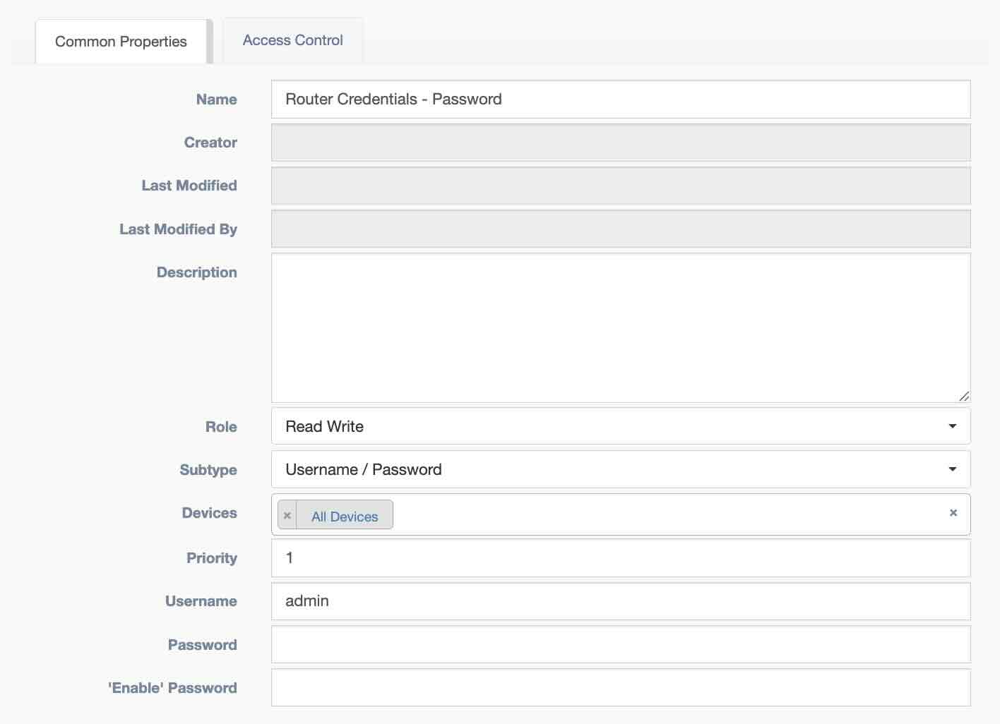
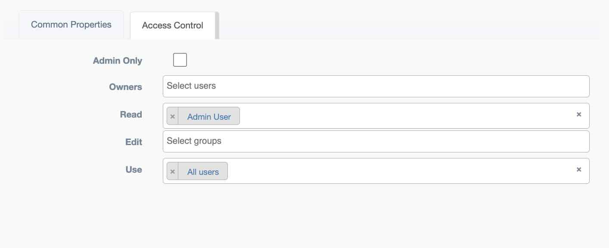

# Credentials

This section explains how to manage username and password details for logging into a device. 

In a typical installation, most credentials are hidden using the `Admin Only` check box described below. However, when a user creates a credential, it becomes available under `Step 2` of most services as a `Named Credential`. 

!!! Advice
    These are the required fields when creating a `Named Credential`:

    - **Name**: Unique identification for referencing the credential
    - **Role**: Read and write, or read only.
    - **Subtype**: Choose between `Username / Password` or `SSH Key`.
    - **Username**: The username for both `Username / Password` and `SSH Key` connections.
    - **Password or Private Key**: If `Subtype` from above is `Username / Password`, the field becomes `Password`. If `Subtype` from above is `SSH Key`, the field becomes `Private Key`. 
    - **'Use' Access**: Groups of users which will have access to these credentials.

 
<h4>Credential Details</h4>

When viewing or editing a credential object, there are two selectable tabs near the top: `Common Properties` and `Access Control`.

The `Common Properties` tab has the following properties: 

* **Name**: Unique identification for referencing the credential
* **Creator**: Auto Populated field based on the user who built the credential
* **Description**: Text field for storing notes  

* **Role**: Read and write, or read only.
* **Subtype**: Choose between `Username / Password` or `SSH Key`.
* **Devices**: Pool of devices which will have access to these credentials.
* **Priority**: When a user has access to multiple credentials for a device, the credential with the highest priority is chosen.
* **Username**: The username for both `Username / Password` and `SSH Key` connections.
* **Password or Private Key**: If `Subtype` from above is `Username / Password`, the field becomes `Password`. If `Subtype` from above is `SSH Key`, the field becomes `Private Key`.  
* **'Enable' Password**: Used by Netmiko based services when Enable mode is selected and a password is required.  This is not related to device connection, but is included on the credential for Vault storage.

The `Access Control` tab has the following properties: 

* **Owners**: Users allowed to modify this `Access Control` instance
* **Admin Only** If enabled, only admin users can view or edit this instance
* **Read**: `Groups` allowed to view this instance
* **Edit**: `Groups` allowed to modify this instance
* **Use**: `Groups` allowed to access these credentials.

 
<h4>Vault Details</h4> 
A vault is typically used to store a device's credentials, for a production environment, Hashicorp Vault is recommended. Credentials may also be stored in the main database. 
