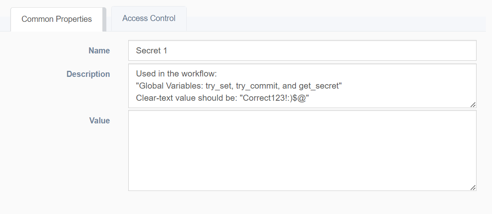
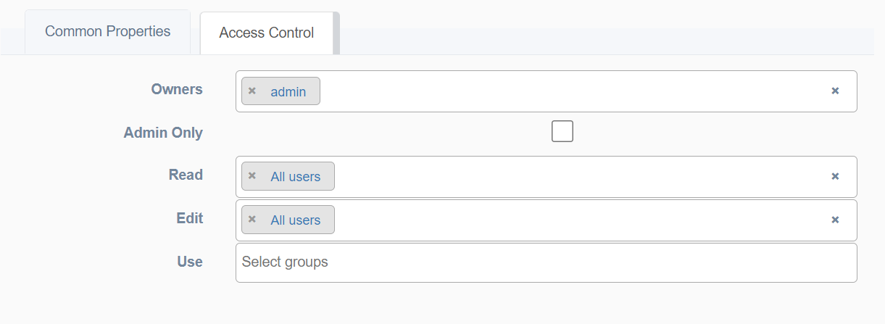
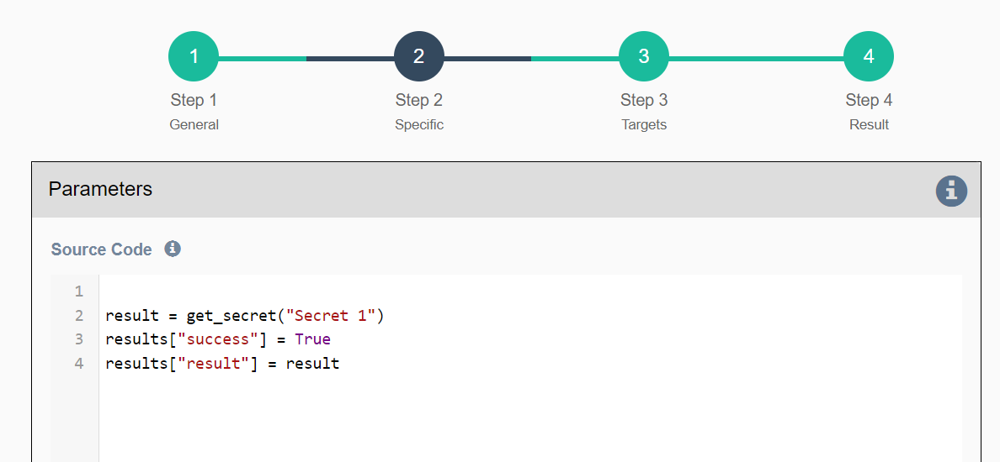

"Secrets" allow users to link a secret value to a key, enabling its use in a workflow without revealing the value to those viewing the workflow.

 
<h4>Main Properties</h4> 

* **Name**: Unique identification for secret name
* **Description**: Text field for storing notes  
* **Value**: Secret value (private property that is never shown in the UI)

 
<h4>RBAC properties</h4> 
Fine control of actions a team can take.

* **Owners**: Users allowed to configure RBAC
* **Admin Only**: If selected, only admin users can access the secret
* **Read Access**: Groups of users allowed to read the secret
* **Edit Access**: Groups of users allowed to edit the secret
* **Use Access**: Groups of users allowed to use the secret in a workflow

 
<h4>Usage</h4>

The `get_secret` function is a global variable in a workflow that retrieves the secret value of a "secret" object by its name. At runtime, the application first checks that the user running the workflow has "Use" RBAC access for the secret object. If access is granted, it returns the associated secret value.

Typical usage includes using a password as part of a Python secret or embedding a password in a URL (e.g., for a REST call) via string substitution (`https://URL&password={{ get_secret("name") }}`).
