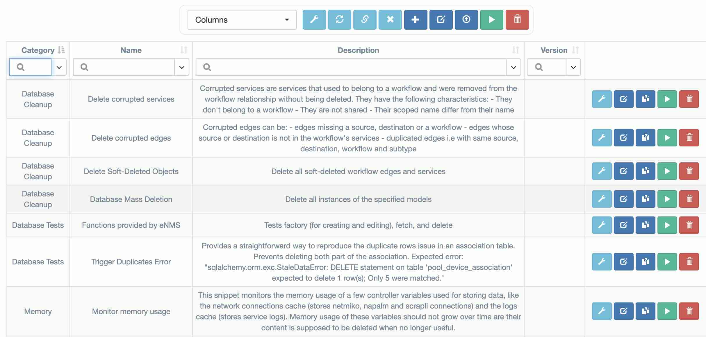

# Snippets

The Snippets page is reserved for admin users only. It provides an interface to run Python snippets for system maintenance and troubleshooting purposes.

## Profiling

The profiling mechanism allows administrators to monitor the performance of each function within the application. It provides detailed metrics to help identify performance bottlenecks and optimize execution time.

The data can be sorted by:
- `count`: the number of times the function has been called
- `average_time`: the average execution time per call
- `combined_time`: the total time spent executing the function

The profiling data can be filtered by origin to focus on specific parts of the application.
Possible origin values include: `Environment`, `Controller`, `Runner`, `CustomApp`, `RestApi`
If the origin is left empty (`""`), all data will be displayed.
