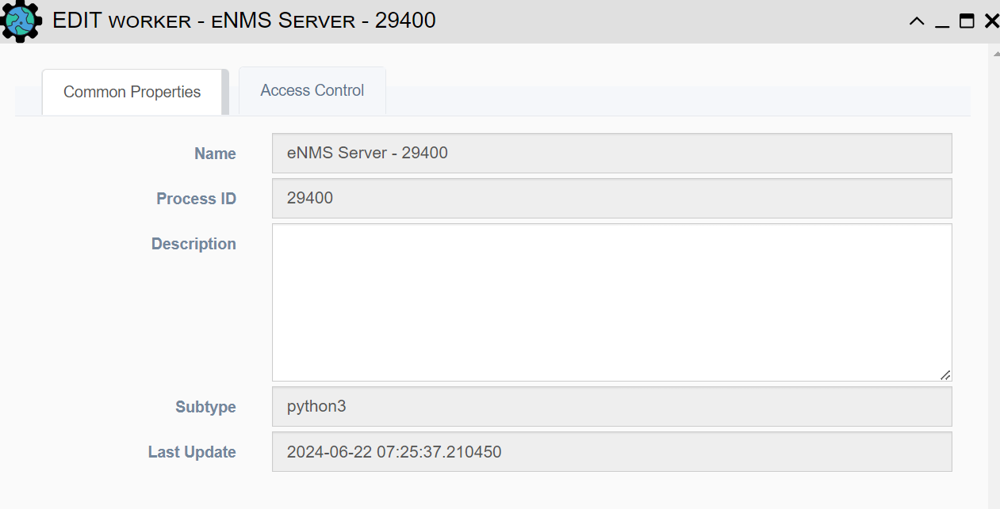

# Servers

<h4>Workers Details</h4> 

* **Name**: Name of the worker - defaults to "Server Name - Process ID"
* **Process ID**: Unix Process ID
* **Description**: Text field for storing notes 
* **Subtype**: Indicates what application spawned the worker. Can be "python3", "gunicorn", "dramatiq", depending on how the application is run and deployed.
* **Last Update**: Last time the worker was updated
