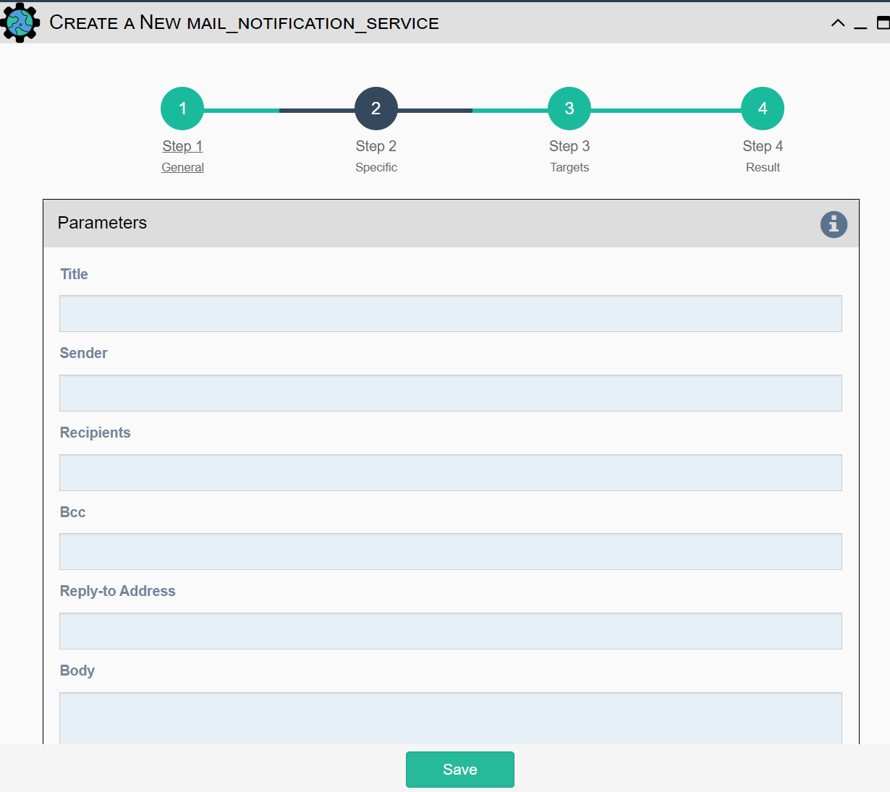

This service is used to send an automatically generated email to a list
of recipients.

-   `Title`: Subject Line of the Email.
-   `Sender`: If left blank, the default email address set in `settings.json`
    will be used.
-   `Recipients`: A comma delimited list of recipients for the email.
-   `BCC` This field (Blind Carbon Copy) allows the sender to send a copy of the email
    to additional recipients without the primary recipients knowing about it
-   `Reply-to Address`: If left blank, the reply-to address from
    `settings.json`: is used. If populated, this email will be used by
    anyone replying to the automated email notification.
-   `Body`: This is the body of the email.

!!! note

    This service supports variable substitution in all input fields of its configuration form.
