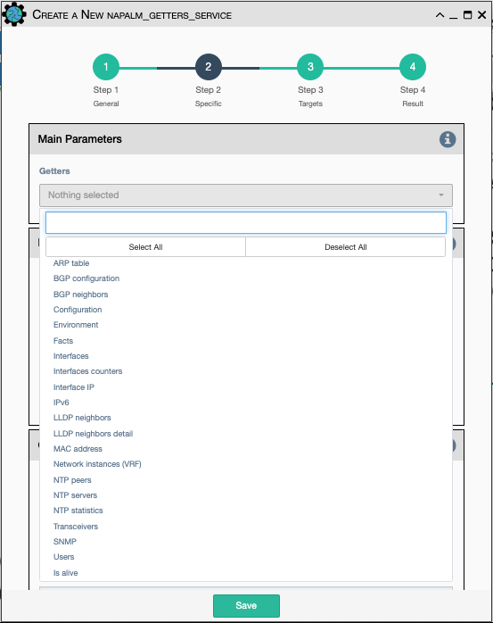

Uses Napalm to retrieve the output of a list of getters. The Napalm library provides
a standard API for communicating with multiple vendors' devices, and it includes
'getters' (this service) for retrieving select show commands / operational data as a structured
(dictionary) result, as well as its companion services: Napalm Configuration/Rollback (for making
device config changes that support rollback), Napalm Ping (for commanding a device to 
ping a selection of other devices), and Napalm Traceroute (for commanding a device to
traceroute a selection of other devices). The output of each can be validated in Step 4
 of the service or later with [Data Validation Service](data_validation.md).

Configuration parameters for creating this service instance:

- All [Napalm Service Common Parameters](napalm_common.md).

- `Getters`: Choose one or more getters to retrieve. Napalm getters
  (standard retrieval APIs) are documented 
  [here](https://napalm.readthedocs.io/en/latest/support/index.html#getters-support-matrix)
  where each getter is listed as being supported or not supported by each of the device
  driver types for Arista EOS, Cisco IOS, IOSXR, IOSXR_NETCONF, Juniper Junos, and
  Cisco NXOS/NXOS_SSH.
  

!!! note
 
    The output of all Napalm Getter APIs is a structured dictionary of data.
    Napalm Getters are a convenient way of retrieving structured data from
    devices, as opposed to retrieving unstructured CLI data from a device with
    Netmiko and having to parse it to convert to structured data.
