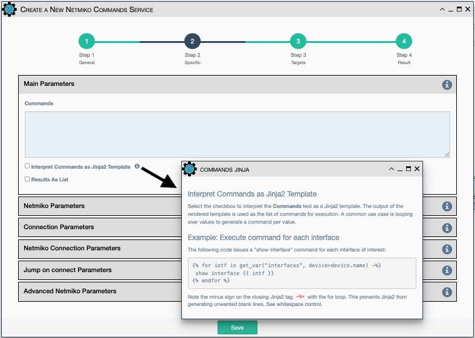

Uses Netmiko to send a command to a device to
determine the state of that device. See the `Workflow` section for
examples of how it is used in a workflow.

Each command is sent to the device and the output is saved as the
service result.  eNMS collects output from each command until
either the prompt or the `expect string` is matched in the output, or until
the `timeout` has elapsed.

While output processing is simpler when a single command is specified,
the service supports sending multiple commands as a single service.  The
same configuration parameters are used for each command.

By default, the output from all commands is returned as a single string.
When multiple commands are specified, a header is prepended to the output
to help identify which output is from which command.  Results from each command can also be returned as a list, using the
`Results As List` option. 

Configuration parameters for creating this service instance:

-  All [Netmiko Service Common Parameters](netmiko_common.md).

- `Commands`: Command(s) to be sent to the device, with each command on a separate line.

- `Interpret Commands as Jinja2 Template`: If checked, the service will expect that the commands are embedded
   in a Jinja2 template in the Commands field. The system will render that Jinja2 template using device
   properties to obtain the set of Commands. This is useful when iterating commands over properties of the device, such as
   its interfaces.
- `Results as List`: If checked, store the command output as a list of 
   individual string results. By default, all output is returned as a single string,
   with a COMMAND header prepended when multiple commands are specified.

Also included in Netmiko Advanced Parameters: 

- `Use TextFSM` (for automatic parsing): Causes Netmiko to try and match the command to a TextFSM
  template pointed to in the system by the `NET_TEXTFSM` environment
  variable. The Network to Code project maintains a repository of TextFSM
  templates for popular network devices [here](https://github.com/networktocode/ntc-templates) in
  the ntc_templates/templates folder [here](https://github.com/networktocode/ntc-templates/tree/master/ntc_templates/templates)
  If the command is found to match an existing template, the system will automatically convert
  unstructured results data to structured/dictionary data for you. This saves the user from 
  having to parse the result data.
- `Use Genie / PyATS` (for automatic parsing): Causes Netmiko to try and match the command to a Cisco Genie/PyATS
  template in the system. The Cisco Genie/PyATS supported hardware vendors, models and commands can
  be referenced [here](https://developer.cisco.com/docs/genie-docs/) by clicking on 'Available APIs'.
  If the command is found to match an existing Genie/PyATS API, the system will automatically
  convert unstructured results data to structured/dictionary data for you. This saves the user from
  having to parse the result data.
- `Auto Find Prompt`: Tries to detect the prompt automatically. Mutually exclusive with `Expect String`.
- `Expect String`: Regular expression that signifies the end of output.
- `Config Mode Command`: The command that will be used to enter config
  mode.
- `Strip command`: Remove the echo of the command from the output
  (default: True).
- `Strip prompt`: Remove the trailing router prompt from the output
  (default: True).

!!! note

    `Expect String` and `Auto Find Prompt` are mutually exclusive; both
    cannot be enabled at the same time. If the user does not expect Netmiko
    to find the prompt automatically, the user should provide the expected
    prompt instead. This is useful when the CLI command sent via Netmiko
    causes the prompt to change, or when restarting and no prompt is expected.
!!! note

    This service supports variable substitution in some input fields of its
    configuration form.
