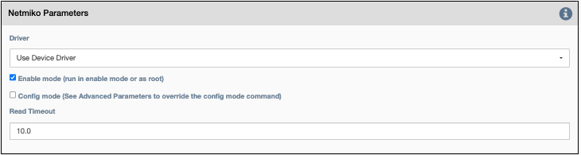
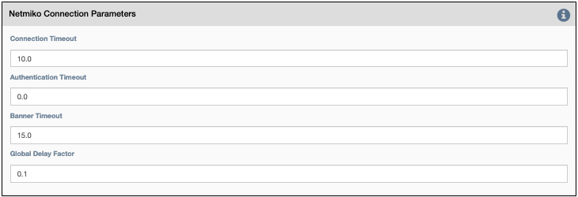

These are the Netmiko Common Parameters for all Netmiko Services.

## Common Netmiko Parameters

-   `Driver`: This selects which Netmiko driver to use when connecting to
    the device. If `Use Device Driver` is checked, the service will use
    the Netmiko driver from the inventory that is associated with the device.
    Otherwise, override and select a particular driver.

!!! Note

    In some cases it is useful to override the driver. One particular example
    is that Napalm Ping is not supported for IOS-XR devices, but the user
    can override the driver to IOS and use the Napalm Ping functionality in
    that driver (ping works the same everywhere; it is not dependent
    on driver functionality).

-   `Enable mode`: If checked, Netmiko should enter enable/privileged
    mode on the device before running the command or applying the
    configuration block. For the Linux driver, this means root/sudo.
-   `Config mode`: If checked, Netmiko should enter config mode.
-   `Read Timeout`: Netmiko internal timeout in seconds to wait for a
    connection or response before declaring failure.

## Connection Parameters

- `Credentials`: Select between:
    - `Device Credentials`: The application will select the most appropriate credential
      object for each device. If there are multiple credentials available, the 
      `Type of Credential` and `Priority` properties become a tiebreaker.
    - `Named Credentials`: Allows users to reference a specific credential for all targets. Selecting this 
      option requires additional selections below.
    - `Custom Credentials`: Allows users to store a credential against this service. Selecting this 
      option requires additional selections below.
      
!!! Advice

    `Named Credentials` selections will persist through duplicating a service, unlike `Custom Credentials`. 
    [For details on creating a `Named Credential` take a look at this page.](../../administration/credentials.md) 

- `Named Credential`: Select from a list of user created credential objects. 
- `Custom Username`: User provided username, stored against this service.
- `Custom Password`: User provided password, stored against this service.

- `Start New Connection`: **before the service runs**, the current
  cached connection is discarded and a new one is started.
    
- `Connection Name`: If changed to something other than `default`, the
  connection will be cached as a separate connection to that same device.
  This allows for multiple simultaneous "named" connections to a single
  device.
    
- `Close Connection`: Once the service is done running, the current
  connection will be closed.

## Netmiko Connection Parameters

-   `Connection Timeout`: In addition to the Netmiko Read Timeout above, this parameter is passed to the 
   underlying Paramiko library as the TCP connection timeout at connect time.
-   `Authentication Timeout`: This timeout value is passed to the underlying Paramiko library as auth_timeout
   at connect time.
-   `Banner Timeout`: This timeout value is passed to the underlying Paramiko library as banner_timeout at
   connect time.
-   `Global delay factor`: Netmiko multiplier used to increase internal
    delays in device communication (defaults to 0.1 for best performance). For slow devices or devices
    connected via slow backhaul links, increase this value starting with 0.2 and increasing up to 5.0 until
    device communication is stable. Since this value affects all devices in a target pool, consider putting
    slow devices in a separate pool that uses a service with a larger Global delay factor. 

## Jump on connect Parameters

Jump on connect is designed to allow a second connection after
connecting to the original device.

-   `Jump to remote device on connect`: If checked, the config items
    below will be used to connect to the secondary device.
-   `Command that jumps to device`: Command to initiate secondary
    connection.
-   `Expected username prompt`: Prompt expected when connecting secondary
    connection.
-   `Device username`: The username to send when the expected username
    prompt is detected.
-   `Expected password prompt`: Prompt expected when connecting secondary
    connection.
-   `Device password`: The password to send when the expected password
    prompt is detected.
-   `Expected prompt after login`: Prompt expected after successfully
    negotiating a connection.
-   `Command to exit device back to original device`: Command required to
    exit the secondary connection.

!!! note

    A number of the above colored text fields support variable substitution
   
