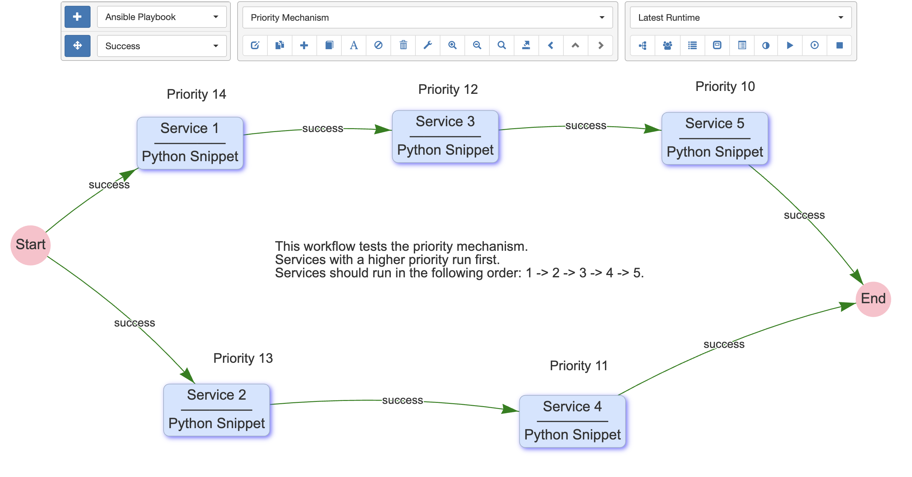
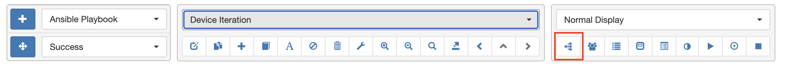
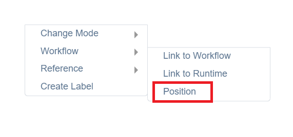
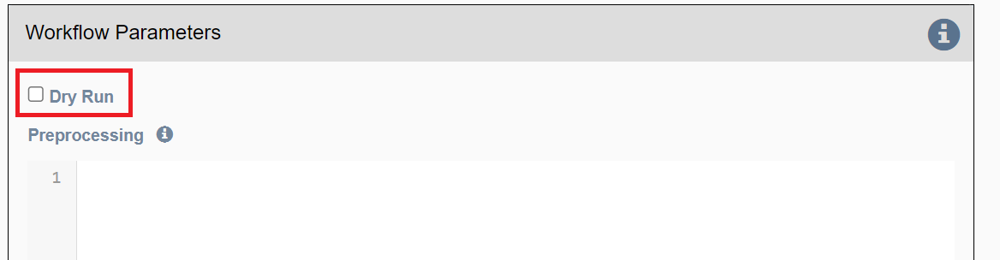
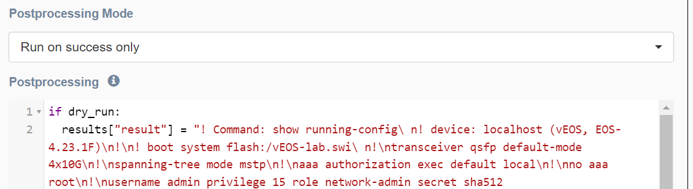

## Service Dependency

If a workflow contains parallel paths of execution, and one service must be
run after another service in another path, you can enforce that order
by configuring Priority in Step1 of the Service/Workflow Editor. One such
example is illustrated here:


 
Priority allows the user to determine the order a service runs when two
services would otherwise be run at the same time. The typical use case is
when a service has two edges exiting from the right side and both edges are
the same type. In this case the user may determine the order of the service
execution using Priority. The higher number gets run first.

## Restart Workflow From Here

Using the right-mouse-click menu, a workflow can be restarted from any
service as the "Entry point" and using the runtime payload from a
previous run. This is useful if:

- the user is testing a workflow with a lot of services.
- device targets fail unreliably and automation must be restarted at 
  unpredictable locations in the workflow and:
  
    a) services are not idempotent, meaning that it is not possible to
       re-run the same services on the devices without breaking, or:

    b) there is simply not enough time to re-run all the previous
       services.
  
Selecting `Restart Workflow from Here` by right clicking on a service 
presents the user with a form to select:

- `Restart Runtime`: The previous runtime to use as the payload for
  continuing the workflow. This defaults to the runtime that is currently
  displayed in the workflow builder.
- `Targets` gives several options for where to obtain device targets for
  the new run:
   
      - Manually defined:  Use the targets manually defined below.
      - Restart run: Use the targets from the selected restart runtime.
      - Workflow:  Use the targets that are currently defined at workflow level.
        
- `Devices`: for use with the `Manually defined` option above.
- `Pools`: for use with the `Manually defined` option above.

!!! note

    Variables, set to values that cannot be streamed as JSON, are not
    available to subsequent services after restarting the workflow. For
    example, if the user performed a set_var on a python function to allow
    it to be used in a subsequent service, this will not work after using
    `Restart Workflow from Here`.

## Disable a Service or Workflow

The `Disabled` property, when checked, prevents a workflow or service from
running from the UI or from the REST API.  This is useful when closed loop
automations that are triggered through the REST API by another system need
to be prevented from running. 

The `Disabled` property is accessed in the UI in the Step 1 Service / Workflow
Editor panel.  And when it is checked, the `Disabled Time & User` is captured
in the UI in a read-only field. The property can also be toggled via the REST
API instance endpoint `rest/instance/service` and passing a payload that looks
like:

```json
{
    "name": "service or workflow name",
    "devices": [""],
    "disabled": true
}
```

!!! note

    Disabling a service inside of a workflow prevents that service from running
    with the Right-Mouse-Click->Run option. It does not prevent that service
    from running when the entire workflow is run: use the Skip option to achieve
    that functionality instead.

## Connection Cache

When using netconf, netmiko, napalm, and scrapli services in a workflow,
eNMS will cache and reuse the connection automatically. The number of open connections
for each library is displayed in the workflow builder as the workflow progresses.

A connection threshold can be defined in the automation.json file to limit the number
of concurrent connections. It is configured with the following parameters:

- `enforce_threshold`: Activates the threshold mechanism (default: `false`)
- `threshold`: Maximum number of connections (default: `100`)
- `log_level`: Log level of the warning (default: `warning`)
- `raise_exception`: Prevents new connections from being created when the threshold is reached

In the Step2 `Connection Parameters` section of a service, there are some properties to
change this behavior :

- `Start New Connection`: **before the service runs**, the current
  cached connection is discarded and a new one is started.
    
- `Connection Name`: If changed to something other than `default`, the
  connection will be cached as a separate connection to that same device.
  This allows for multiple simultaneous "named" connections to a single
  device, as in this example:
  
  
    
- `Close Connection`: once the service is done running, the current
  connection will be closed.

## Waiting Times and Retries

Services and Workflows have a `Time to Wait` property: this tells eNMS
how much time it should wait after the service has run before it begins
the next service.

A service can also be configured to `Retry` in the event of a failure. 
Retries allow for a `Number of Retries`, `Time between retries`, `Max
number of retries` to be configured. 

The `Max number of retries` exists because it is possible for the user to
manipulate the `retries` variable in `post processing` section for service
results.  For example, the user could set additional retries in the event
of some condition, or perhaps if something is missing in the results, increase
retries by `1`.  This `Max number of retries` is settable to prevent an
infinite loop from occurring: once it is reached, the service will fail.

To demonstrate the relationship between retries and wait times, an example
execution of a service in a workflow is as follows:

    First try (failure)
    time between retries pause
    Retry 1 (failure)
    time between retries pause
    Retry 2  (Successful, or only 2 Retries specified)
    Waiting time pause

## Superworkflow

Just as a workflow can contain a subworkflow to subdivide and
encapsulate related functionality, a workflow can also designate a
superworkflow in `Step2`. The superworkflow allows for services to
be run before and after the main workflow and using a potentially
different workflow traversal mode (service by service or device by
device). 

Superworkflows function like a document template so that
activities common to all workflows can be performed. When the same
superworkflow is used by multiple main workflows, it behaves like a
shared service: a change to the superworkflow affects all workflows that
use it. 

In the superworkflow definition in Workflow Builder, the
position of the main workflow is designated by adding the `Placeholder`
service to the graph. And in the main workflow definition, the
superworkflow must be selected from the list of existing workflows.

## Workflow Tree

A special "tree" display is available in the workflow builder to help manage workflows with many services or multiple subworkflows.

Enable the tree display by clicking the "tree" icon in the middle menu of the workflow builder.

  

The tree will appear on the right side of the builder.

  

The tree automatically tracks the current workflow:

- Only the services on the path of the displayed workflow are open by default.
- The currently displayed workflow is highlighted in blue in the tree.

Double-clicking a service will automatically select and focus on that service. If the service is in another workflow, it will switch to that workflow.

When a workflow has a superworkflow, it is displayed as part of the tree.

## Runtime Notes

Labels in a workflow are always displayed, whether in "Normal Display" mode or when viewing a specific runtime. However, a specific type of label, referred to as "notes," can be created and deleted during a runtime in Python.

Notes can be created with the `add_note` function: `set_note(-10.24, 22.5, "note1")`. The first two parameters are the position, and the third is the content of the note. Notes can be removed with the `remove_note` function: `remove_note(-10.24, 22.5)`.

A position in the workflow builder can be obtained from the right-click menu ("Reference" / "Position"):

  

If a note is not removed by the end of the run, it will be permanently displayed when viewing that specific runtime in the workflow builder.

## Dry Run

"Dry Run" is a mechanism that allows a service to return results as part of a run without actually executing the service. This is useful when building a workflow with services that connect to network devices, as it enables testing without hitting the network.

"Dry Run" is a service property configured in the service's Edit Panel, step 3, under the "Workflow Parameters" section.



While the service itself does not run, the string substitution mechanism is applied, giving the user an idea of the parameters the service would use if it weren't in "Dry Run" mode.

A global variable, `dry_run` (set to True if the service is in Dry Run mode, and False otherwise), is available for users to tweak the results of a service in "Dry Run" mode. This variable can be used to change the service results only if "Dry Run" is enabled. These results can then be used by subsequent services.

Example use-case: A netmiko service is configured to retrieve a device's configuration. In normal mode, it connects to the device and runs the command to get the configuration. In "Dry Run" mode (`if dry_run`), the configuration is manually defined in the post-processing section. Subsequent services using this configuration will function as if the netmiko service had actually connected to the device, resulting in faster execution speed.


