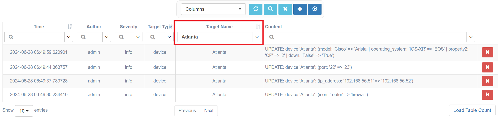
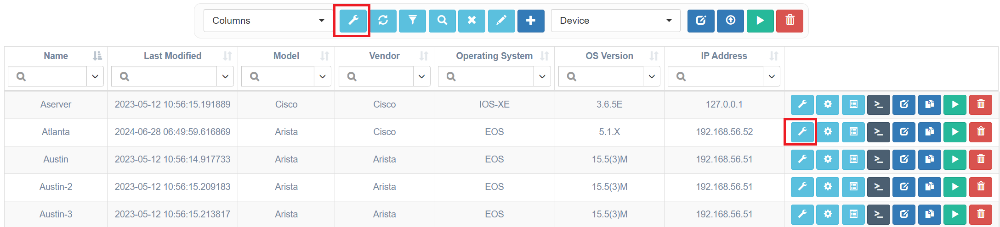
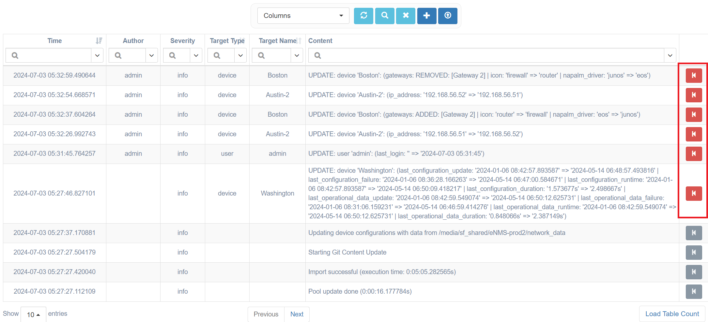

# Changelog

## Overview

The eNMS changelog is found under `System / Changelog`

Changelog contains the following searchable information:

-   Object creation, deletion, and modification activity.
-   Running of services / workflows; when they ran, who ran them.
-   Various administration logs, such as database migration,
    parameter updates, etc.
-   Custom logs, defined by users in services / workflows.

## Object Changelogs

Some changelogs are linked to specific objects, detailing how they were created, updated, or deleted.
In the changelogs table, you can enable the "target type" and "target name" columns to see which object each changelog pertains to.

A change linked to a specific object can sometimes be reverted or undone. The "Revert" icon on the right side of the changelogs table allows you to do this. If the icon is greyed out, the "Revert" action is not available.

## Filtering Changelogs

You can filter changelogs to see all entries for a specific object type or a particular object. There are two ways to do this:

In the changelog table:

- Show the "Target Type" and "Target Name" columns.
- Type the object type or name you want to filter by in the search fields at the top of these columns.

For example, here's how to view changelogs for the device named "Atlanta" only from the changelog table:

From other tables:

- Click the "Changelogs" button in the top menu to see all changelogs for the type of objects shown in the table.
- Click the "Changelogs" button in an object's row to see all changelogs for that specific object.

For example, you can click these buttons to view changelogs for all devices (using the top menu bar) or just for the device named "Atlanta" (using the row-specific button):

## Reverting Changelogs

Some of the changelogs linked to an object can be undone. The following changes support reversion:

- Updating standard properties (strings, integers, and lists)
- Updating one-to-many (scalar) and many-to-many relationship
- Deletion of non-shared services and edges in the workflow builder

Changelogs can be undone by clicking the red button on the right side of a row in the changelog table. If the button is greyed out, reversion is not supported for that specific type of changelog.

## Workflow Changelogs

Workflow changelogs are handled uniquely because they must include not only changes to the workflow object itself but also:

- Updates to any service or edge in that workflow (including services and edges in subworkflows, subworkflows' subworkflows, and so on)
- Changes to labels (adding, editing, and deleting)
- Creating and deleting services and workflow edges
