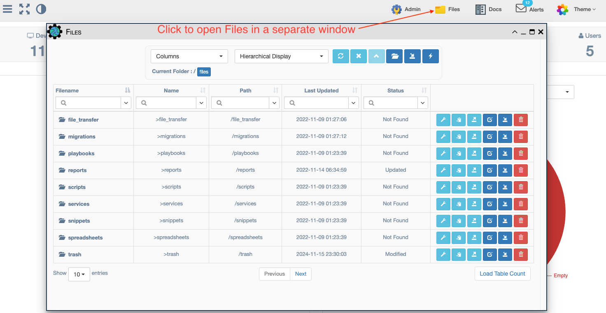
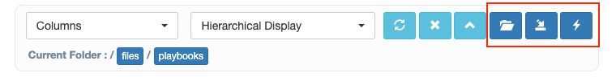
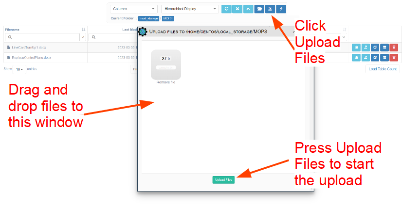
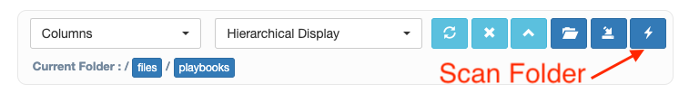

## Overview 

The Files management provides information about a specific folder (local or network)
and provides a mechanism to interact with files and folders in that location.

A routine file watcher will detect and add new files and folders as they are created,
and it will also update their modified date when they change. A manual "Scan Folder" option also 
provides a way to reload the file and folder data in a specific folder.

The Files information can be viewed either from:

- The System -> Files navigation menu, or 

  

- From the top navigation bar, from the Files icon.

  

## Folder Navigation  

Click on any Folder to open it and view the Files (and Folders) that it contains.
The top of the page will display the Current Folder.

To navigate between folders: 

- Click on any of the blue breadcrumbs highlighted next to the `Current Folder` label, or 
- Click on the "up" `^` navigation button at the top, or 
- Click on any folder shown inside the table itself.

## Files Management 

These actions from the top button bar provide ways to create folders, create files, and 
delete both folders and files from the database. 

- `Create New Folder`: create a new folder in the current folder

  

- `Upload Files`: upload one or more files into the current folder 

  - To start the upload: 

    

  - When finished, the window will show successful checkmark(s): 

    

- `Scan Folder`: manually refresh the contents based on what is physically present in the folder location

  

  
These actions apply to each individual file or folder:

- `Copy Path to Clipboard`: copy the relative path to the file or folder to the clipboard
- `Download File`: downloads a single file or a .TGZ file with contents of the entire folder 
- `Upload Files in Folder`: only shown for a Folder, opens the Upload File window
- `Edit`: edit the File or Folder details (e.g., Description)
- `File Content`: only shown for a File, show the File - with option to save changes
- `Delete`: remove file/folder from the database (not the file system)

 
