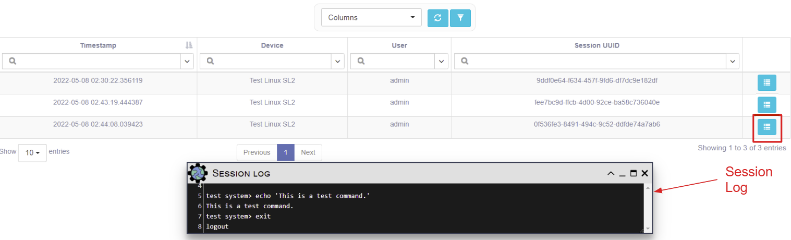

# Sessions

As a security feature, eNMS stores device interactions initiated via the 
WebSSH Connection feature into Session objects. Access to Sessions is RBAC-controlled. By default, the user who initiates a Session is set as the owner of the Session object. The “Read” access field is left empty (no groups assigned).

Users can use the `System -> Sessions` page to view the Session data:

  