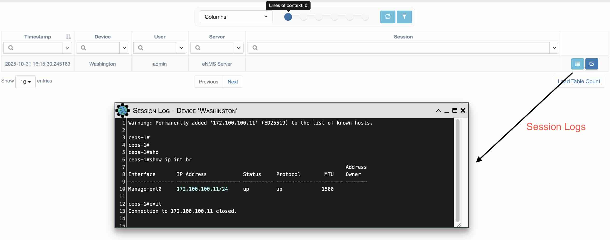
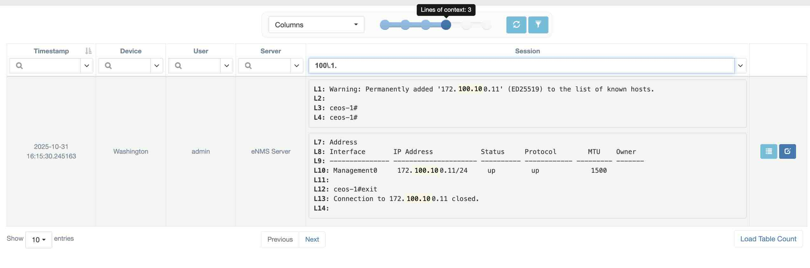

# Sessions

As a security feature, eNMS stores device interactions initiated via the 
WebSSH Connection feature into Session objects. Access to Sessions is RBAC-controlled. By default, the user who initiates a Session is set as the owner of the Session object. The “Read” access field is left empty (no groups assigned).

Users can use the `System -> Sessions` page to view the Session data:

Users can search the content of all sessions using the `Session` field in the table, just like with device configurations.
At the top of the table, you can adjust the number of lines of context to display, from 0 to 5.

Here’s an example of a search using the regular expression `100\.1.` (with the filter set to “Regular Expression” for the “Session” column):

